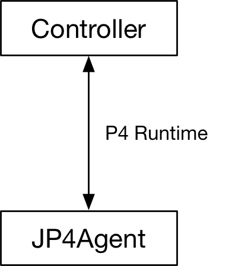
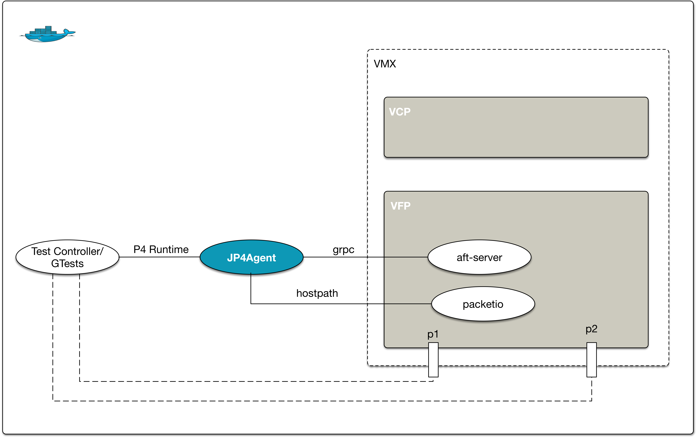
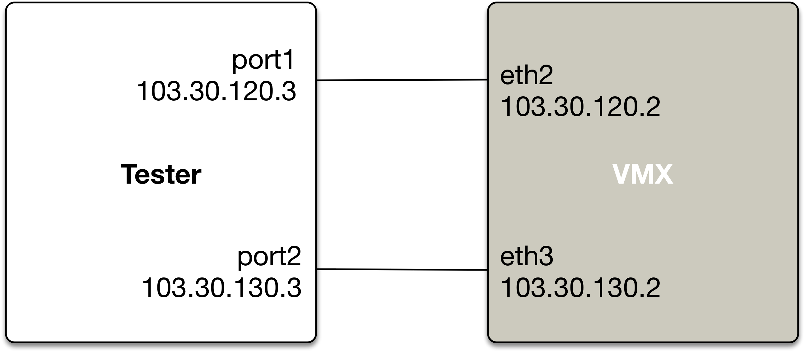

[](https://travis-ci.com/Juniper/JP4Agent)

##### Note: Use of this software is governed by an Apache 2.0 license, and can be found in the “LICENSE” file.

JP4Agent (Juniper P4 Agent)
==========================
Juniper's P4 Runtime server implementation.

<br>
<div style="text-align:center" align="center"></div>
<br>
<br>


JP4Agent GitHub Repository
=====================
This repository provides:
* JP4Agent source code
* Setup configuration and scripts
* Test controller and gtest code
* Dockerfile(s), configuration and scripts for Docker container where VMX and JP4Agent run
* Regression scripts

#### Repository Directory Structure
```
 -- JP4Agent
    |-- LICENSE              License 
    |-- README.md            This README file
	|-- AFI                  AFI data model
	|-- build                Build scripts
	|-- cli                  Command line
	|-- config               JP4Agent Configurations
	|-- docs                 Documentation
	|-- src
	|   |-- afi              AFI HAL
	|   |-- jp4agent         JP4Agent
	|   |-- pi               PI layer
	|   |-- targets
	|   |   |-- aft          AFT target HALP
	|   |   |-- brcm         Broadcom target HALP
	|   |   `-- null         Null target HALP
	|   `-- utils            Utils
	|-- test
	|   |-- controller       Test controller
	|   `-- gtest            GTests for JP4agent
	`-- tools
		|-- config           Setup configuration
		|-- docker           Dockerfile(s), configuration and scripts for Docker
		`-- scripts          Setup and regression scripts
```

Requirements
=====================
#### Juniper Networks Software
VMX tarball provided by Juniper
```
jnprP4vmx.tgz    : Contains all the images/packages needed to run VMX in a container
```
Note: Please contact Juniper to get 'jnprP4vmx.tgz'. <br>
Contacts are listed at the bottom of this page.

#### System Requirements
```
Hardware requirements
=====================
Processor: 
    Any x86 processor (Intel or AMD) with VT-d capability
Number of Cores: 
    4 (1 for VCP and 3 for VFP)
Memory:
    Minimum:
    8 GB (2 GB for VCP, 6 GB for VFP)
    Additional
    2 GB recommended for host OS
Storage: 
    Local or NAS. Minimum 100 GB is recommended.
       
Software requirements
=====================
Operating system
    Ubuntu 14.04 LTS or 16.04 LTS
Docker
    Community Edition (CE) or Enterprise Edition (EE)
```

<br>
<br>
<div style="text-align:center" align="center">  </div>
<br>
<br>

### STEP 1. Install Docker engine on Linux host server
Please refer to instructions provided on the following page to install Docker engine on the host server  
[https://docs.docker.com/engine/installation/linux/ubuntu/](https://docs.docker.com/engine/installation/linux/ubuntu/)


### STEP 2. Pull p4-vmx Docker image
Note: Docker ID (https://hub.docker.com) is needed for this step. <br>
Please create, if you do not already have one. <br>
Contact Juniper to get access to the Docker image repo. <br>
Contact is listed at the bottom of this page.
```
docker login
<< Enter username and password when prompted
[sudo] docker pull juniper/p4-vmx:latest
```

### STEP 3. Get VMX tarball from Juniper and extract it
```
Get 'jnprP4vmx.tgz' tarball from Juniper and extract it to any preferred location on the host.
E.g.,
export HOST_VMX_LOC=/home/sandesh/VMX
mkdir $HOST_VMX_LOC
mv jnprP4vmx.tgz $HOST_VMX_LOC
cd $HOST_VMX_LOC
tar xf jnprP4vmx.tgz
```

### STEP 4. Clone JP4Agent repo
```
Clone JP4Agent to any preferred folder on the host. 
E.g.,
cd $HOME
git clone git@github.com:Juniper/JP4Agent.git
```

### STEP 5. Set env variable JP4AGENT_REPO to JP4Agent repo location
```
export JP4AGENT_REPO=$HOME/JP4Agent
```

### STEP 6. Update VMX setup configuration
```
Update the configuration in file $JP4AGENT_REPO/tools/config/vmx-cfg.xml
to modify the following:
  1. The 2 host interfaces to use for traffic : by default eth1 & eth2
  2. The management interface to use: by default eth0
  3. Console ports for vCP & vFP: by default 8601 & 8602
  4. Management IPs for vCP & vFP to ssh into it
  5. Location where 'jnprP4vmx.tgz' tarball was extracted.

```

### STEP 7. Install required packages on host server
```
cd $JP4AGENT_REPO/tools/scripts
[sudo] ./install_packages.sh
```

### STEP 8. Setup VMX

NOTE: This step runs Docker with netwroking mode 'host' (--network=host), <br>
to make all host interfaces availabe inside docker. <br>
Please note this mode disables network isolation of the Docker container i.e. <br>
container shares the networking namespace of the host.

```
cd $JP4AGENT_REPO/tools/scripts
./setup-vmx
```
Please wait for the following message to appear before proceeding with next step. <br>
"VMX Setup Complete!" <br>
Please login to the vCP using ssh and verify that interfaces xe-0/0/0:1 and xe-0/0/0:2 are up <br>
<br>
Note: Please go through "Working with VMX" section of '[**docs/README.md**](./docs/README.md)' to learn <br>
how to work with VMX setup, viz.,  how to login to VCP and VFP, run Junos CLI commands etc.
<br>

### STEP 9. Run regression
```
cd $JP4AGENT_REPO/tools/scripts
./run-regression

```
Please observe the output. When the output shows 'GTEST RESULT: PASS', you are good to go.
You can open url `http://<host ip>:9000` in browser to see the regression results visually.

### STEP 10. Connect external tester and send unidirectional traffic
```
Connect the 2 interfaces specified in vmx-cfg.xml with an external tester
Configure Port 1: IP 103.30.120.3/24 and external gateway 103.30.120.2/24
Configure Port 2: IP 103.30.130.3/24 and external gateway 103.30.130.2/24

In the example below,
if1=eth2
if2=eth3

```
<br>
<br>
<div style="text-align:center" align="center">  </div>
<br>
<br>

### STEP 11. Before stopping docker container, shutdown vmx gracefully
```
cd /root/VMX
../JP4Agent/tools/docker/scripts/stop_vmx.sh

In case docker is stopped accidentally without graceful vmx shutdown, clean up from the host
cd $JP4AGENT_REPO/tools/scripts
[sudo] ./bridge_cleanup.sh

```

Contact
=======
<b>Sandesh Kumar Sodhi</b> <br>
sksodhi at juniper.net
