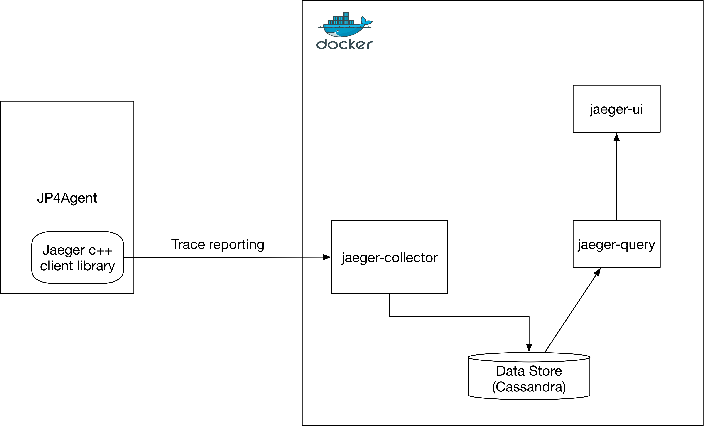

Jaeger documentation


## Working with Jaeger

### Jaeger basics
```
https://jaeger.readthedocs.io/en/latest/architecture/
```

<br>
<div style="text-align:center" align="center"></div>
<br>
<br>

### STEP 1: Launch the Jaeger backend using All-in-one Docker image on a server reachable from JP4Agent.
```
docker run -d -e COLLECTOR_ZIPKIN_HTTP_PORT=9411 -p5775:5775/udp -p6831:6831/udp -p6832:6832/udp \
  -p5778:5778 -p16686:16686 -p14268:14268 -p9411:9411 jaegertracing/all-in-one:latest
```

### STEP 2: Update JP4Agent/src/config.yaml with the IP address of the server running Jaeger backend
```
e.g. if Jaeger backend is running on 120.54.23.21

localAgentHostPort: 120.54.23.21:6831

hostPort: 120.54.23.21:5778
```

### STEP3: Launch Docker GUI in browser using IP address of Jaeger backend
```
E.g. if Jaeger backend IP is 120.54.23.21

http://120.54.23.21:16686

Alternately, if browser is running on the same host as Jaeger back end use

http://127.0.0.1:16686
```

### NOTES
```
    1. Jaeger backend should be run on a host different from the one running vMX
    2. Jaeger Backend must be started prior to launching JP4Agent.
    3. Ensure that date and time on the servers running JP4Agent and Jaeger backend are in synch.
```
