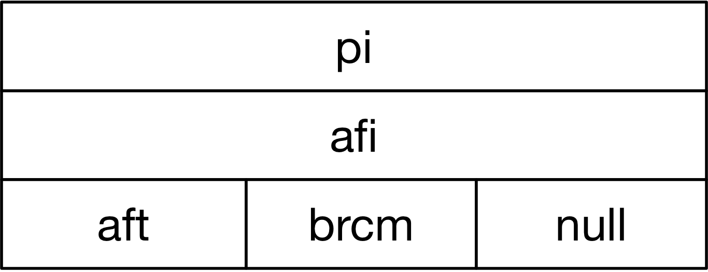

<br>
<div style="text-align:center" align="center"></div>
<br>
<br>

### Compile jp4agent
```
cd build

To build JPAgent with aft target:
./make-all-aft.sh

To build JPAgent with aft target:
./make-all-null.sh
```

### Run jp4agent
```
To run JPAgent (aft target):
cd src/targets/aft/bin
./run-jp4agent 

To run JPAgent (null target):
cd src/targets/null/bin
./run-jp4agent 

```
